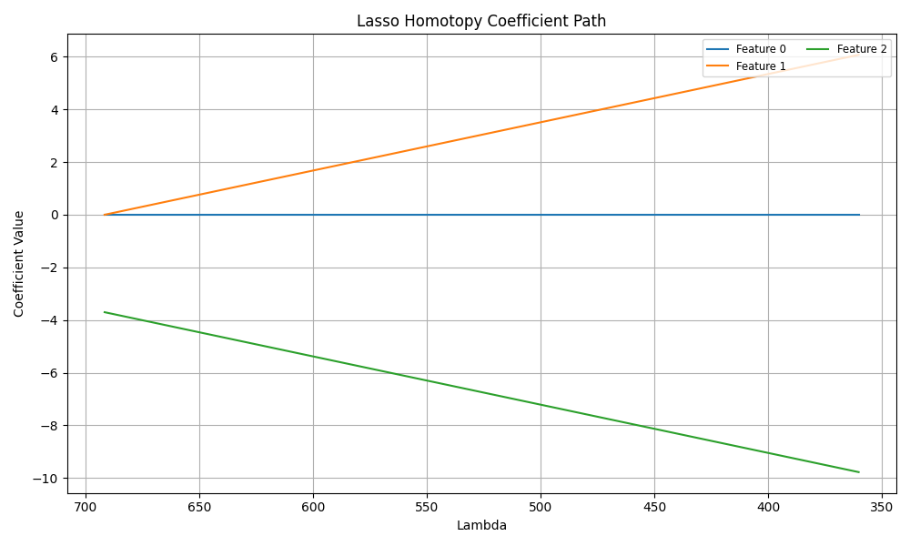
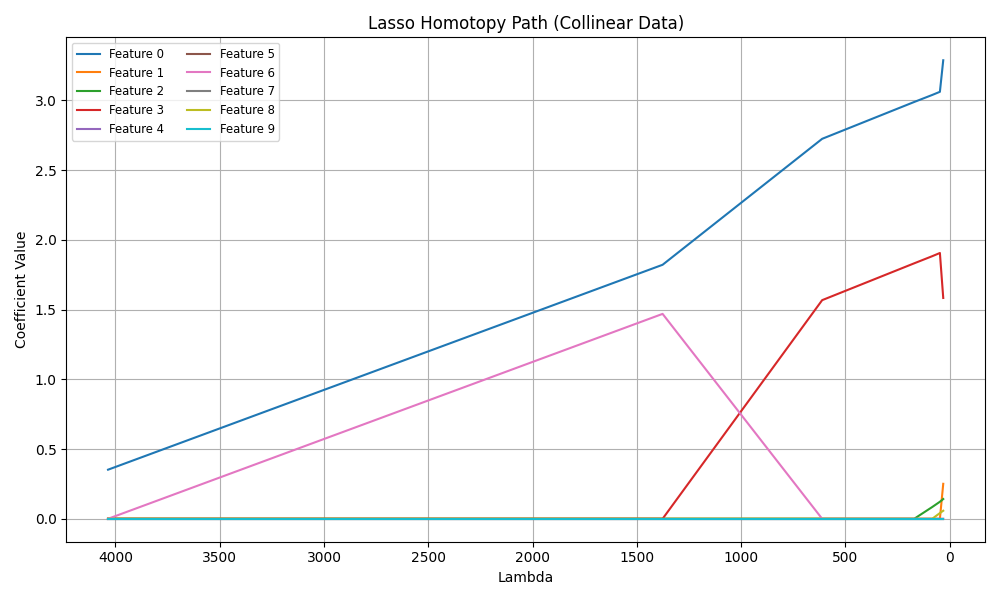
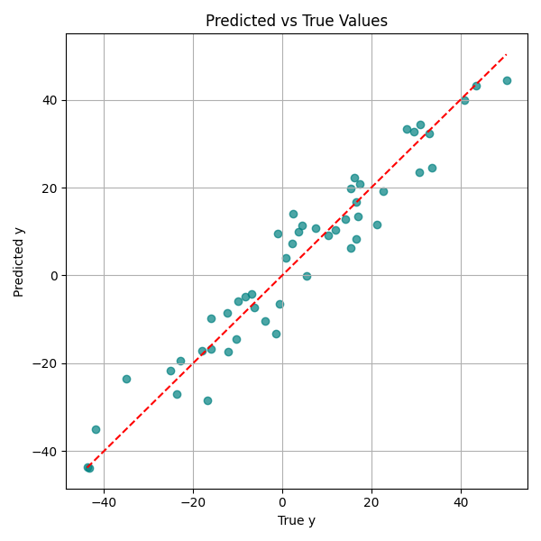
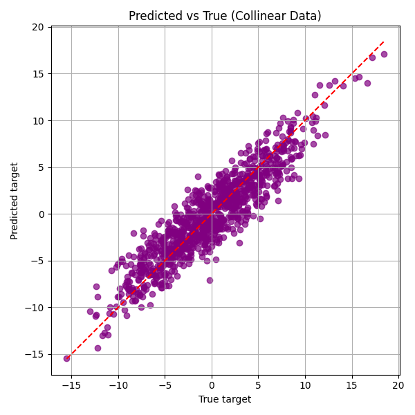
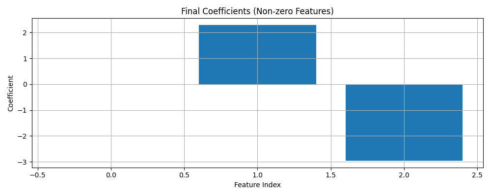
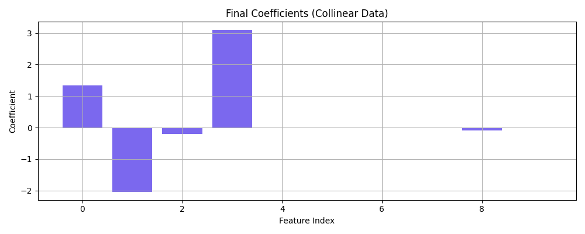

# Project 1: Lasso Regression using the Homotopy Algorithm

---

## Table of Contents

1. [Introduction](#introduction)
2. [Overview](#overview)
3. [How the Model Works](#how-the-model-works)
4. [Getting Started](#getting-started)
5. [Test Coverage](#test-coverage)
6. [Summary of Test Scenarios](#summary-of-test-scenarios)
7. [Visual Output Samples](#visual-output-samples)
8. [Adjustable Parameters](#adjustable-parameters)
9. [Limitations & Future Work](#limitations--future-work)
10. [Q&A](#qa)
11. [Team Members](#team-members)

---

## Introduction

This repository demonstrates an end-to-end implementation of LASSO (Least Absolute Shrinkage and Selection Operator) regression, built entirely from scratch using NumPy. We adopted a **Homotopy-based solver**, which is known for its efficiency in computing the LASSO solution path as the regularization parameter decreases.

Unlike conventional solvers that rely on coordinate descent or library wrappers, our goal was to **build a numerically stable and interpretable version from first principles**, offering more insight into how sparsity is introduced during optimization.

---
## Overview

The Lasso Regression model is a popular method in statistics and machine learning, especially when working with high-dimensional data. It encourages sparse solutions by applying an L1 penalty on the coefficients, effectively driving some of them to zero.

In this project, we implement LASSO using the **Homotopy Algorithm**, which incrementally traces the path of the solution as the regularization parameter (lambda) changes — making it computationally attractive when the entire solution path is needed.

This project aims to:

- Recreate the Lasso Homotopy model without relying on `scikit-learn`
- Handle both small and collinear datasets
- Compare performance across various parameter settings
- Visualize coefficient evolution as lambda decreases
- Offer reproducible tests to validate implementation correctness

---

## How the Model Works

The Homotopy algorithm is based on the concept of **piecewise linearity** in the Lasso solution path. It:

1. Starts with a high value of lambda (strong regularization) and all coefficients at zero
2. Identifies the feature with the highest correlation with the residual
3. Gradually adds/removes features to the active set as lambda decreases
4. Updates coefficients analytically until a breakpoint (feature enters or leaves the model)
5. Stops once the stopping condition (lambda threshold) is reached

The algorithm efficiently handles changes in active sets and signs, relying on pseudoinverse updates and correlation tracking for numerical stability.

The implementation also includes:
- **OLS debiasing** for better final accuracy
- **Manual feature standardization**
- **Transition logging via test outputs and visualization**

---

## Getting Started

### 1️⃣ Installation

Clone the repository and navigate to the root directory:

```bash
git clone https://github.com/Nupur-Gudigar/Project1.git
cd Project1-LassoHomotopy
```

## Create a virtual environment (optional but recommended):

```bash
python -m venv venv
```
### Activate it:

On Windows:

```bash 
venv\Scripts\activate
```

On macOS/Linux:

```bash
source venv/bin/activate
```

### Install dependencies:

```bash
pip install -r requirements.txt
```

## Running the Model & Visualizations

### Usage Example
```bash
from model.LassoHomotopy import LassoHomotopyModel
import numpy as np

# Generate some data
X = np.random.randn(100, 10)
true_coef = np.array([3.0, 0.0, 0.0, 5.0, 0.0, 0.0, 0.0, 0.0, -2.0, 0.0])
y = X @ true_coef + np.random.randn(100) * 0.1

# Fit Lasso model
model = LassoHomotopyModel()
model.fit(X, y)

# Predicts
y_pred = model.predict(X)
print("Coefficients:", model.coef_)
print("Intercept:", model.intercept_)
```
- These Coefficients should be very close to the given original true_coef.
- The small non-zero values near zero are due to the small noise added to y and because of the regularization encouraging sparsity.
- Coefficients which are exactly zero show that Lasso implementation eliminates features, as expected.
- Intercept represents how the Lasso model fits it as part of the bias term. Expect Small deviation because y includes a small noise component.

### To explore how the coefficients evolve:

```bash
jupyter notebook LassoHomotopy_Visualization.ipynb
```

This notebook contains:

- Coefficient path visualization

- Performance metrics (MSE, MAE, R²)

- Support for both `small_test.csv` and `collinear_data.csv`

## Running the Tests

# Navigate to the tests folder:

```bash
cd tests
```

Run all test cases with full console outputs:

```bash
pytest -s
```
You’ll see:

- Printed metrics for each dataset

- Output from collinearity and edge case tests

- Assertions for coefficient sparsity, OLS equivalence, and more

### You can also manually run the test file:
```bash
python test_LassoHomotopy.py
```

## Testing Methodology

We created a diverse test suite to evaluate the correctness, robustness, and behavior of the Lasso Homotopy model. All tests are implemented using `pytest` and print relevant metrics such as MSE, MAE, and R² for inspection.

### Test Descriptions

- **Basic Fit Accuracy**: Ensures the model fits well on `small_test.csv` with reasonable error.
- **Sparsity on Collinear Data**: Validates that the model drives some coefficients to near-zero when features are collinear.
- **Known Collinear Columns**: Specifically checks if one of two known correlated columns is zeroed out.
- **OLS Equivalence (α = 0)**: Compares Lasso output to `np.linalg.lstsq()` when no regularization is applied.
- **High Tolerance**: Tests if early stopping works correctly (via `tol`).
- **Few Iterations**: Simulates underfitting when `max_iter` is very small.
- **Random Noise Target**: Fits on pure noise to verify that coefficients are minimal.
- **Normalized Input**: Ensures the model works properly with standardized features.
- **Stricter Sparsity Enforcement**: Checks that the number of non-zero coefficients remains low.

---

### Test Case Summary

| No. | Test Function           | Dataset               | Description                                                   | Expected Output                                           |
|-----|-------------------------|------------------------|---------------------------------------------------------------|-----------------------------------------------------------|
| 1   | `test_small_dataset`    | `small_test.csv`       | Verifies model accuracy on a simple dataset                   | Low MSE, MAE; R² ≈ 0.93                                   |
| 2   | `test_collinear_sparsity` | `collinear_data.csv` | Ensures sparsity by shrinking irrelevant collinear features   | Some coefficients ≈ 0                                     |
| 3   | `test_collinear_csv`    | `collinear_data.csv`   | Tests if one of two highly correlated features is eliminated  | Either `coef[3]` or `coef[4]` ≈ 0                         |
| 4   | `test_alpha_zero_OLS`  | Synthetic              | α = 0 should mimic OLS behavior                               | Coefficients and intercept match OLS                      |
| 5   | `test_high_tolerance`  | `small_test.csv`       | Early stopping with high tolerance                            | Faster convergence, slight accuracy drop                  |
| 6   | `test_few_iterations`  | `small_test.csv`       | Checks model behavior with very few iterations                | Underfitting, high error expected                         |
| 7   | `test_random_target`   | `small_test.csv`       | Random target values (pure noise)                             | Coefficients ≈ 0, R² ≈ 0                                  |
| 8   | `test_normalized_input` | `collinear_data.csv`  | Fit using normalized features                                 | Similar performance to unnormalized                       |
| 9   | `test_strict_sparsity` | `collinear_data.csv`   | Ensures non-zero coefficients count is ≤ 5                    | Non-zero weights ≤ 5                                      |

Each test prints metrics to the terminal and runs with `pytest -s` for transparency.

---

## Output and Visualizations

This project includes a `LassoHomotopy_Visualization.ipynb` notebook to help visualize and understand how the model behaves across different datasets and λ (lambda) values.

---

### 1. Lasso Coefficient Path

This line plot shows how the coefficients of each feature evolve as the regularization parameter **λ** decreases. It helps visualize:

- When a feature enters the model (non-zero coefficient)
- When a feature drops out (returns to zero)
- The relative importance of features across λ values

**Example Datasets Used:**

- `small_test.csv` → Only 3 features → Clear path sparsity  
- `collinear_data.csv` → 10 features → More complex sparsity dynamics  

#### 🔹 Coefficient Path (small_test.csv)


#### 🔹 Coefficient Path (collinear_data.csv)


---

### 2. Predicted vs True Plot

This scatter plot compares the model’s predicted values to actual target values (`y_true`). A red dashed line `y = x` is included for reference.

- Points close to the line → good predictions  
- Large deviations → indicate model error or poor fit  

**Generated for:**

- Both `small_test.csv` and `collinear_data.csv`  
- Helps visualize predictive performance on training data  

#### 🔹 Predicted vs Actual (small_test.csv)



#### 🔹 Predicted vs Actual (collinear_data.csv)


---

### 3. Final Non-Zero Coefficients Plot

A bar chart that displays the **non-zero coefficients** at the end of the Homotopy path.

- **X-axis**: Feature indices  
- **Y-axis**: Final coefficient values  
- Coefficients with absolute value **< 1e-4** are considered zero  

This plot is helpful to understand which features the model has selected (i.e., the sparse solution).

#### 🔹 Final Coefficients (small_test.csv)


#### 🔹 Final Coefficients (collinear_data.csv)


---

### Sample Visualization Types

| Visualization Type                | Description                                                       |
|----------------------------------|-------------------------------------------------------------------|
| **Coefficient Path Plot**        | Tracks how each feature's coefficient changes with λ              |
| **True vs Predicted Scatter Plot** | Visual check of accuracy; how well predictions align with `y = x` |
| **Non-Zero Coefficients Bar Chart** | Shows which features were retained in the final model             |

---

> To switch datasets in the notebook, update this line:
> ```python
> X, y = load_data("collinear_data.csv", label_col="target")
> ```
> or
> ```python
> X, y = load_data("small_test.csv", label_col="y")
> ```

## Answers to Questions

---

### 1) What does the model you have implemented do and when should it be used?

The implemented model is a **LASSO (Least Absolute Shrinkage and Selection Operator)** regression using the **Homotopy Method**. It is used for linear regression tasks where:

- Feature selection is important  
- Data has **many correlated features**  
- You expect a **sparse** solution (only a few features matter)

 **When to use it:**

- You want to identify and retain only the most relevant features  
- Your dataset has more features than samples  
- You’re dealing with collinearity and need interpretability

---

### 2) How did you test your model to determine if it is working reasonably correctly?

We used multiple approaches to evaluate correctness:

- **Pytest test cases** covering basic behavior, edge cases, and convergence  
- **Multiple CSV datasets** (`small_test.csv`, `collinear_data.csv`) to check performance  
- **Regression metrics**: MSE, MAE, and R²  
- **Manual inspection**: We observed model predictions against ground truth using scatter plots  
- **Sparsity behavior**: We ensured collinear features are zeroed out as expected

---

### 3) What parameters have you exposed to users of your implementation in order to tune performance?

The following hyperparameters can be tuned:

- `tol`: Convergence tolerance for early stopping  
- `alpha`: L1 regularization strength  
- `lambda_min_ratio`: Controls the stopping value for λ in the homotopy path  
- `normalize`: Whether to normalize input features  
- `max_iter`: (If supported) Limit the number of homotopy iterations

---

### 4) Are there specific inputs that your implementation has trouble with? Could you work around these given more time?

Yes, like most regression solvers, certain edge cases can be problematic:

#### Current Limitations:

- **Perfect multicollinearity**: Can cause instability in matrix operations → mitigated using `np.linalg.pinv`  
- **Very large feature space**: Homotopy is computationally intensive for wide datasets  
- **Random or noisy target values**: LASSO may overfit small signal noise if not tuned properly

#### Potential Improvements (if given more time):

- Implement **batch processing** or **warm start** for streaming data  
- Use **sparse matrix operations** for large inputs  
- Include **k-fold cross-validation** as a built-in part of the model to auto-tune alpha  
- Improve convergence speed with smarter path tracking and caching

---

## Team Members

This project was completed as part of **CS 584 – Machine Learning** coursework.

| Name              | A-Number     | Email                          |
|-------------------|--------------|--------------------------------|
| Nupur Gudigar     | A20549865     | ngudigar@hawk.iit.edu          |
| Zaigham Shaikh    | A20554429     | zshaikh4@hawk.iit.edu          |
| Nehil Joshi       | A20554381     | njoshi20@hawk.iit.edu           |
| Riddhi Das        | A20582829     | rdas8@hawk.iit.edu             |


---


